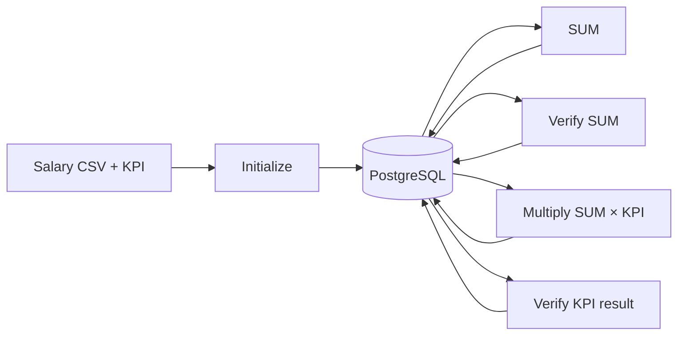

# Tổng quan CPU HE demo

## PostgreSQL schema

| Table | Nội dung |
|---|---|
| `he_demo_sessions` | Scheme, trạng thái và số salary của mỗi session. |
| `he_demo_results` | Expected/decrypted/error riêng cho SUM và SUM × KPI. |
| `he_demo_artifacts` | Context, ciphertext, evaluation key và wrapped secret key dạng `bytea`. |
| `he_demo_operations` | Lịch sử initialize, sum, multiply và verify. |

## HE được exposed như thế nào

- PostgreSQL chỉ có Service nội bộ; HE Jobs hiện kết nối qua port-forward trên `node3`.
- SUM/Multiply chỉ đọc context, ciphertext và evaluation key; không nhận plaintext hoặc raw secret key.
- Raw secret key không lưu trong PostgreSQL. Database chỉ lưu key đã được AES-GCM wrap.
- Verify Jobs là trusted Jobs: unwrap key trong `/tmp`, decrypt một kết quả rồi cập nhật `he_demo_results`.
- CPU demo không gọi HTTP `/v1/evaluate` của GPU service.

## Job input và output

| Job | Input | Output |
|---|---|---|
| `schema` | `schema.sql`, DB credential | 4 bảng PostgreSQL |
| `initialize` | Salary CSV, KPI, scheme, wrapping key | Context, encrypted salary/KPI, evaluation keys, wrapped key, expected values |
| `sum` | Context, salary ciphertext, SUM keys | `sum_ciphertext` |
| `verify-sum` | Context, `sum_ciphertext`, wrapped key | Decrypted SUM và error |
| `multiply` | Context, `sum_ciphertext`, KPI ciphertext, multiply keys | `kpi_result_ciphertext` |
| `verify-kpi` | Context, `kpi_result_ciphertext`, wrapped key | Decrypted SUM × KPI, error và trạng thái `VERIFIED` |
