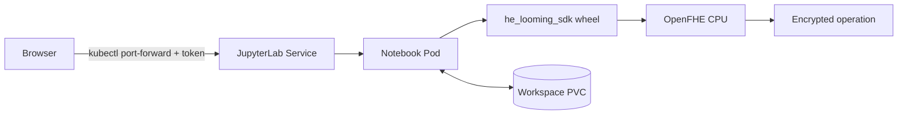

# HE notebook playground

This is the smallest deployed interface for experimenting with the SDK. The
browser talks to JupyterLab, and Python calls the local OpenFHE backend inside
the same Pod. PostgreSQL, the evaluator HTTP API, GPU workers, and Ingress are
not part of this path.



## 1. Build the image in GitLab CI

Push the `k3s-demo-app` commit that contains `Dockerfile.notebook`. The
`build-he-notebook` job uses the wheel from `build-sdk-wheel` and publishes:

```text
docker.io/dockerboi99/he_k8s:notebook-<short-commit-sha>
docker.io/dockerboi99/he_k8s:notebook-latest
```

No Jupyter, OpenFHE compiler, Docker build, or Python package install is needed
on your own computer. Wait for the notebook build job to succeed, then use its
immutable `notebook-<short-commit-sha>` tag below.

## 2. Deploy to K3s

Run from the `k3s-demo-gitops` checkout on the server that has working
`kubectl` access:

```sh
git pull --ff-only origin main
./scripts/notebook/deploy.sh notebook-<short-commit-sha>
```

The deploy helper creates or updates:

- one Secret containing the Jupyter access token;
- one ConfigMap containing the tracked playground notebook;
- one 2 GiB workspace PVC;
- one CPU-only JupyterLab Deployment and one ClusterIP Service.

The first deployment generates a random token. To provide your own token on
that first run, use:

```sh
HE_NOTEBOOK_TOKEN='<long-random-token>' \
  ./scripts/notebook/deploy.sh notebook-<short-commit-sha>
```

The token is stored only in Kubernetes, not in Git. Later deploys preserve it.

## 3. Open JupyterLab

On the machine where you want the local browser connection, run:

```sh
./scripts/notebook/open.sh
```

The script prints a `http://127.0.0.1:18888/lab?token=...` URL and keeps the
port-forward running. Open that URL and keep the terminal open. The Service is
not exposed through Ingress or a public `NodePort`.

If your browser is on a different computer from the K3s server, create an SSH
tunnel first:

```sh
ssh -L 18888:127.0.0.1:18888 <user>@<k3s-server>
```

Then run `./scripts/notebook/open.sh` on the server and open
`http://127.0.0.1:18888/lab` on your computer. Paste the printed token if
Jupyter asks for it.

## 4. Use the playground

Open `he_playground.ipynb` and run cells from top to bottom:

1. Import `HESession` and define two small vectors.
2. Create one OpenFHE session. Context and key generation may take noticeably
   longer than a normal Python import.
3. Run the direct `encrypt -> square -> decrypt` example.
4. Change `OPERATION` to `add`, `subtract`, `multiply`, `square`, `sum`, `mean`,
   or `variance` and run that cell again.
5. Set `RUN_ALL = True` only when you want the full seven-operation check.
6. Close the session when finished, then shut down the kernel from JupyterLab.

CKKS results are approximate, so the notebook checks numeric tolerance rather
than exact float equality.

## Persistence and notebook updates

Your editable `he_playground.ipynb` lives on the PVC and survives Pod restarts.
Every deployment also writes the newest Git version as
`he_playground.latest.ipynb`. This prevents a GitOps update from overwriting
your experiments. Copy cells from the latest file when you want to adopt an
updated template.

## Checks and troubleshooting

```sh
kubectl -n he-dev get pod,service,pvc | grep he-notebook
kubectl -n he-dev logs deployment/he-notebook -c jupyterlab --tail=100
kubectl -n he-dev describe pod -l app=he-notebook
```

- `ImagePullBackOff`: verify that the CI job published the exact immutable tag.
- `Pending` PVC: verify that the K3s cluster has a default storage class (the
  normal K3s `local-path` provisioner is sufficient).
- Pod not ready: inspect the JupyterLab logs and confirm the node has enough RAM
  for OpenFHE context/key generation.
- Token rejected: delete only `secret/he-notebook-auth` and rerun deploy to
  generate a new one. Existing notebook files on the PVC are unaffected.

## Stop or remove

Stop compute while retaining notebook files:

```sh
kubectl -n he-dev scale deployment/he-notebook --replicas=0
```

Deleting the PVC permanently deletes saved notebooks, so it is intentionally
not part of the normal cleanup instructions.
