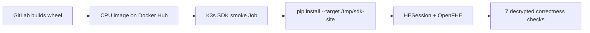

# Install and test the HE SDK wheel

## Artifact location

GitLab CI builds `he_looming_sdk-<version>-py3-none-any.whl` once. The wheel is
available in two places:

1. As the `build-sdk-wheel` GitLab job artifact for 60 days.
2. Permanently inside the matching immutable Docker Hub CPU image at
   `/opt/he-sdk-wheel/`, together with `SHA256SUMS` and the compatibility
   manifest.

The second form is recommended for the K3s lab because the image already
contains the matching OpenFHE native runtime.

## First test: run the Python file

The most direct test is [`scripts/sdk/test_sdk.py`](../scripts/sdk/test_sdk.py).
It imports `HESession`, executes each SDK function explicitly, decrypts the
result, and compares it with normal Python arithmetic.

On a supported Ubuntu server, extract the wheel from the immutable image:

```sh
mkdir -p dist
docker pull docker.io/dockerboi99/he_k8s:cpu-<short-sha>
container_id=$(docker create docker.io/dockerboi99/he_k8s:cpu-<short-sha>)
docker cp "$container_id:/opt/he-sdk-wheel/." ./dist/
docker rm "$container_id"
```

Create the environment and run the Python file:

```sh
python3 -m venv .venv-he-sdk
. .venv-he-sdk/bin/activate
python -m pip install openfhe==1.5.1.0.24.4
python -m pip install ./dist/he_looming_sdk-*.whl
python scripts/sdk/test_sdk.py
```

Expected final output:

```text
{"operation": "add", ..., "status": "PASS"}
...
{"operation": "variance", ..., "status": "PASS"}
SDK_PYTHON_TEST=PASS
```

If you do not want to install OpenFHE on the server host, run the same Python
file inside the published CPU image:

```sh
docker run --rm \
  -v "$PWD/scripts/sdk/test_sdk.py:/tmp/test_sdk.py:ro" \
  --entrypoint /bin/sh \
  docker.io/dockerboi99/he_k8s:cpu-<short-sha> \
  -ec 'cd /opt/he-sdk-wheel && sha256sum -c SHA256SUMS && \
       python -m pip install --no-cache-dir --no-deps \
         --target /tmp/sdk-site he_looming_sdk-*.whl && \
       cd /tmp && PYTHONPATH=/tmp/sdk-site python test_sdk.py'
```

This container command is the recommended first server test: only Docker and
the Python file are needed on the host.

## Second test: K3s Job

After the application pipeline publishes `cpu-<short-sha>`, run from the
GitOps repository:

```sh
./scripts/sdk/run-smoke.sh cpu-<short-sha>
```

The Job verifies the SHA-256 checksum before installation and then performs
this flow:



The expected final log lines include:

```text
SDK_SMOKE_RESULT={"backend": "openfhe", ..., "status": "PASS"}
PASS: installed and tested the wheel from docker.io/...:cpu-<short-sha>
```

This Job tests local SDK execution. It does not call `/v1/evaluate`, so keep
the existing service benchmark as the independent HTTP/K3s verification path.

The SDK wheel is pure Python, but actual HE execution still requires the
pinned OpenFHE native package. The published CPU image already supplies that
dependency, which is why the K3s Job requires no host installation.
