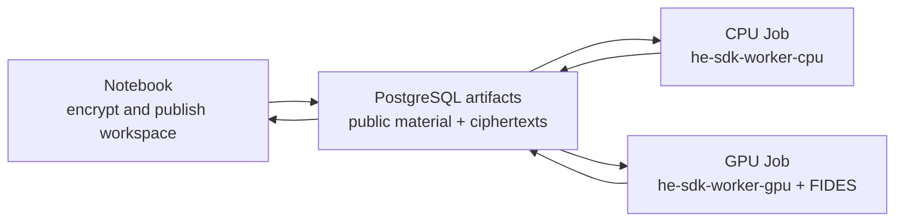

# HE SDK workloads on K3s

The SDK is a library. K3s deploys a small application that imports the SDK and
executes one encrypted operation, rather than deploying the SDK as an HTTP
service.

## Runtime split



The worker Pod receives no secret key. It can load encrypted vectors, execute
`add`, `subtract`, `multiply`, `square`, `sum`, `mean`, or `variance`, and save
another ciphertext to the same logical workspace. Decryption remains in the
trusted Notebook/owner process.

Each Job materializes the secretless workspace from PostgreSQL into its own
`emptyDir`, computes, and publishes the updated encrypted artifacts. This
avoids trying to mount the Notebook's `ReadWriteOnce` PVC from the separate T4
node. PostgreSQL is acceptable for the current small lab artifacts; move large
ciphertext payloads to object storage before production scale.

## CI images

GitLab CI builds the SDK wheel first, then builds these consumers:

```text
docker.io/dockerboi99/he_k8s:sdk-worker-cpu-<short-sha>
docker.io/dockerboi99/he_k8s:sdk-worker-gpu-<short-sha>
```

Use immutable commit tags for acceptance. The `*-latest` defaults in
`config/he-lab.env` are only staging conveniences.

The CPU image installs the core wheel and OpenFHE. The GPU image installs the
same core wheel plus `he-sdk-fides`, FIDESlib, its matching patched OpenFHE,
and the native `he-gpu-worker`. There is no automatic CPU fallback.

## Prepare and publish a workspace

From the Notebook, save the workspace under its mounted `/workspace` PVC:

```python
from he_sdk import HESession

owner = HESession.create(backend="openfhe")
encrypted = owner.encrypt([10.0, 20.0, 30.0, 40.0])
owner.save(encrypted, "/workspace/runs/demo", name="input")
```

Keep `owner` on the trusted side if the result will be decrypted later. Publish
the workspace with the Notebook's existing `publish_workspace(connection,
RUN_ID, workspace)` helper. The stored workspace contains public/evaluation
material and ciphertexts, not the secret key.

## Run CPU or GPU

Apply the current idempotent PostgreSQL schema first; this also migrates
artifact uniqueness to `run_id + workspace_path + sha256`:

```sh
./scripts/postgres/deploy.sh
```

Configure immutable images when available:

```sh
export HE_SDK_CPU_WORKER_IMAGE=docker.io/dockerboi99/he_k8s:sdk-worker-cpu-<short-sha>
export HE_SDK_GPU_WORKER_IMAGE=docker.io/dockerboi99/he_k8s:sdk-worker-gpu-<short-sha>
```

Execute the same input on CPU and GPU:

```sh
RUN_ID=42  # use the id printed by the owner Notebook
./scripts/sdk/run-workload.sh cpu sum "$RUN_ID" input cpu_sum
./scripts/sdk/run-workload.sh gpu sum "$RUN_ID" input gpu_sum
```

Binary operation example:

```sh
./scripts/sdk/run-workload.sh gpu add "$RUN_ID" left gpu_added right
```

The script creates a uniquely named Job, waits for completion, prints the
worker JSON log, and prints Pod events/details when the Job fails.

Back in the trusted Notebook, restore the latest workspace from PostgreSQL and
decrypt:

```python
load_workspace(connection, RUN_ID, workspace)
cpu_result = owner.load(workspace, name="cpu_sum")
gpu_result = owner.load(workspace, name="gpu_sum")

print(owner.decrypt(cpu_result))
print(owner.decrypt(gpu_result))
```

## GPU acceptance boundary

A successful CPU-only GitLab build proves that the GPU image compiled; it does
not prove CUDA runtime correctness. Accept an immutable GPU image only after a
Job on the T4 node completes and the trusted owner decrypts a result equivalent
to the CPU result within the CKKS tolerance.

If the CUDA runtime, device plugin, FIDES worker, serialized artifact, or
operation is incompatible, the GPU Job must fail. Keep the Job logs and
`kubectl describe` output; do not silently reroute it to CPU.

## Current limits

- One input vector supports up to 8192 values with the stable profile.
- Automatic ciphertext chunking is not part of this worker release.
- Kubernetes adds throughput by running independent Jobs; it does not split one
  ciphertext across many Pods.
- Run independent PostgreSQL `run_id` workspaces in parallel. Do not submit
  concurrent writers to the same run until manifest merging is implemented.
- Result release remains a trusted owner-side step and is not performed by the
  compute-only Job.
