# What we are building and testing

## Goal

Build a small function-as-a-service layer for homomorphic encryption (HE).
An application chooses a normal function such as `add` or `sum`; it should not
need to manage OpenFHE calls, CUDA code, rescaling, or evaluation keys itself.

We are developing one function at a time. The main ciphertext API currently
contains:

```text
add -> subtract -> multiply -> square -> sum -> mean -> variance
```

`variance` is population variance `E[x²] - E[x]²` and needs both multiplication
and rotation keys. The next candidates after correctness and benchmark checks
are `weighted_sum` and `covariance`.

## Function delivery rule

From now on, a requested function is complete only when the same operation is
available through all of these layers:

1. CPU OpenFHE and GPU FIDESlib backend code, when the library supports it.
2. Main ciphertext endpoint `POST /v1/evaluate`.
3. Plaintext-input diagnostic endpoint `POST /v1/demo/evaluate` using real HE
   internally: create keys, encrypt, evaluate, decrypt, and return the checked
   value.
4. A tiny direct curl/client check suitable for deployment troubleshooting.
5. A benchmark case that records correctness and timing against the plaintext
   Python/Pandas baseline.

Do not advertise a function as finished merely because it appears in
`/v1/capabilities` for the main API. The demo is required for fast K3s and GPU
verification; the ciphertext API remains required for the real trust boundary.

Current demo gap:

| Backend | Main `/v1/evaluate` | Demo coverage now | Required next work |
| --- | --- | --- | --- |
| CPU | seven functions | `/v1/demo/evaluate`: all seven; `/v1/demo/sum`: large SUM | benchmark beyond SUM |
| GPU | seven functions | `/v1/demo/evaluate`: all seven; `/v1/demo/sum`: large SUM | benchmark beyond SUM |

## Security and service boundary

```text
trusted client Job                         evaluator Service
------------------                        -----------------
create context and keys
create or load plaintext data
encrypt data
send context + required eval keys + ciphertexts  --------->
                                            evaluate ciphertext only
                                      <--------- result ciphertext
decrypt and verify result
```

The main `/v1/evaluate` evaluator must never receive plaintext or the secret
key. The benchmark client is trusted because it owns encryption, decryption,
and correctness checking. The `/v1/demo/*` endpoints deliberately accept
plaintext for diagnostics and must never be described as the production
security boundary.

The API is currently a low-level encrypted evaluator API:

```text
POST /v1/evaluate
operation = add | subtract | multiply | square | sum | mean | variance
```

The longer-term API should hide HE parameters behind a reviewable plan. It
must follow our HE parameter rules: CKKS for approximate real numbers, depth
based on the calculation path, automatic scaling, and only the evaluation
keys required by the selected functions.

## CPU and GPU design

Both implementations stay in `k3s-demo-app`, but they are separate images and
separate processes:

| Target | Runtime | Current state |
| --- | --- | --- |
| CPU | standard OpenFHE-Python | service and benchmark available |
| GPU | FIDESlib with its patched OpenFHE | API/worker transport implemented; NVIDIA server verification pending |

High-level GPU file flow:

```mermaid
flowchart LR
    HE["gpu/worker/src/fides_backend.cpp<br/>seven main HE operations"]
    WORKER["gpu/worker/src/main.cpp<br/>connects API to FIDESlib backend"]
    API["gpu/api/app.py<br/>exposes /v1/evaluate"]
    IMAGE["gpu/Dockerfile<br/>packages API + worker + FIDESlib"]
    CI[".gitlab-ci.yml<br/>builds gpu-latest"]
    K8S["k8s/gpu-evaluator.yaml<br/>deploys GPU API Service"]
    CLIENT["service_benchmark.py<br/>or another trusted client"]

    HE --> WORKER --> API --> IMAGE --> CI --> K8S
    CLIENT -->|"HTTP request"| K8S
    K8S -->|"encrypted response"| CLIENT
```



Standard OpenFHE and FIDESlib's patched OpenFHE must never be linked into the
same image or process. A successful CUDA image build is not a GPU benchmark.
GPU results count only after the FIDESlib function executes and a trusted
client verifies the decrypted answer.

## What the benchmark is testing

The benchmark runs as a Kubernetes Job and calls the deployed ClusterIP
Service. It does not call a local OpenFHE session as a substitute for the
service.

For each function it compares:

```text
plain Python operation
versus
client encryption + serialization + HTTP/service evaluation + decryption
```

It records Python time, encryption time, serialization time, service
round-trip time, evaluator time, decryption time, total HE time, slowdown,
throughput, CKKS error, and PASS/FAIL.

One comparison Job can run several sizes, for example:

```text
50k, 100k, 500k, 1m, 10m values
```

Inputs are generated once into reusable persistent CSV pairs, then processed
one profile/size at a time in bounded service requests so CPU and GPU receive
identical values without retaining the largest arrays for the whole Job. For
now, CKKS inputs stay within
`[-40000, 40000]` and use ten named profiles: positive/negative integers and
positive/negative decimals with 1, 2, 3, or 6 decimal places. Profile, actual
range, seed, size, and repetitions are recorded in every result. A separate
two-profile integer stress group progresses toward positive/negative one
billion without replacing those bounded datasets. The raw result contract is in
[`benchmark-data-contract.md`](benchmark-data-contract.md).

## Current SUM limitation

Within one `/v1/demo/sum` request (maximum one million values), the service
encrypts CKKS chunks, evaluates each encrypted SUM, combines encrypted partial
sums, and decrypts once. Above one million, the comparison runner sends
multiple requests and combines their returned partial plaintext scalars in the
trusted client. It labels that result `global_scalar_client_combined`.

This is enough to measure deployed SUM work across a 10-million-value input,
but it is not fully encrypted aggregation across requests. That future path
must combine result ciphertexts under one compatible context and decrypt once.

## Repository responsibilities

```text
k3s-demo-app
  HE backend functions, HTTP API, tests, Dockerfiles, GitLab image builds

k3s-demo-gitops
  direct K3s deployment, benchmark Jobs, run commands, collected result files
```

Argo CD is intentionally paused while this service and benchmark contract is
stabilized. Benchmark result files stay outside Git through
`benchmark_runs/`.

## Development roadmap

1. Build both images and verify `square`, `mean`, and `variance` through the
   CPU/GPU native demo endpoints on K3s.
2. Add one small direct test command that runs the selected operation against
   an already deployed Service; deployment must remain a separate command.
3. Benchmark `sum` first at several sizes in one Job, initially using one data
   profile. Then run all ten sign/precision profiles and extend the same driver
   to the other six functions. Run 10m only after smaller sizes pass.
4. Verify the real `/v1/evaluate` ciphertext path independently; a passing
   plaintext demo does not prove the secretless serialization path.
5. Add `weighted_sum`, then `covariance`, one vertical slice at
   a time under the function delivery rule above.
6. Tune depth, modulus chain, rescale, relinearization, rotations, threading,
   and GPU batch sizes only after correctness and comparable timing exist.

Before starting the next HE function:

1. The current function returns the correct decrypted result on CPU and GPU.
2. The 50k test passes first, followed by the larger sizes.
3. No main `/v1/evaluate` request or log contains plaintext or a secret key;
   demo requests are clearly labelled as trusted plaintext diagnostics.
4. Timings and accuracy are saved in a reviewable JSON result.
5. The fully encrypted cross-chunk SUM behavior is either implemented or its
   client-side final aggregation remains clearly labelled.
6. GPU performance is not accepted until the FIDESlib request/response path
   passes decryption and correctness checks on the NVIDIA server.
